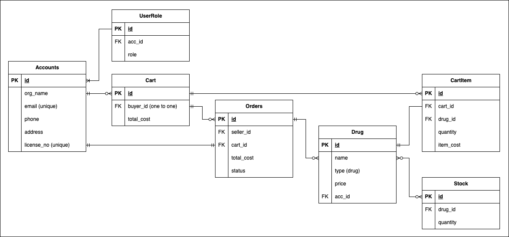

# Pharmacy Inventory Management System API

This is our demo of Pharmacy Inventory Management System api built using Django Rest Framework. This API handles organizations, user roles, medicines, inventory management, and cart functionalities. 

## Table of Contents

- [Pharmacy Management System API](#pharmacy-management-system-api)
  - [Table of Contents](#table-of-contents)
  - [Features](#features)
  - [ER Diagram](#er-diagram)
  - [Requirements](#requirements)
  - [Installation](#installation)

## Features

- Manage organizations and user roles.
- CRUD operations for medicines and inventory management.
- Cart functionality for managing pharmacy orders.


## ER Diagram

The following diagram represents the database schema:




- **Organization**: Stores organization information (name, email, password, etc.).
- **UserRole**: Defines roles within an organization.
- **Medicine**: Stores information about medicines.
- **Inventory**: Tracks the quantity of each medicine in stock.
- **Cart**: Represents a shopping cart for an organization.
- **CartItem**: Represents items within a cart, and handles inventory updates.
- **Request**: Represents pharmacy requests, including status and total cost.

(Note: The ER diagram can be updated in future versions of the project.)

## Requirements

- Python 3.x
- Django 4.x
- Django Rest Framework 3.x
- Postman (for API testing)
  
You can find all the required Python packages in `requirements.txt`.

## Installation

1. **Clone the repository**:
    ```bash
    git clone https://github.com/FahadOSD/Pharmacy-Management-System.git
    cd Pharmacy-Management-System.
    ```

2. **Create a virtual environment and activate it:**
    ```bash
    python3 -m venv env
    source env/bin/activate   # On Windows: env\Scripts\activate
    ```

3. **Install the dependencies:**
    ```bash
    pip install -r requirements.txt     
    ```

4. **Run migrations:**
    ```bash
    python manage.py migrate
    ```

5. **Start the development server:**
    ```bash
    python manage.py runserver
    ```

6. **Access the API:**
The API will be available at http://127.0.0.1:8000/
